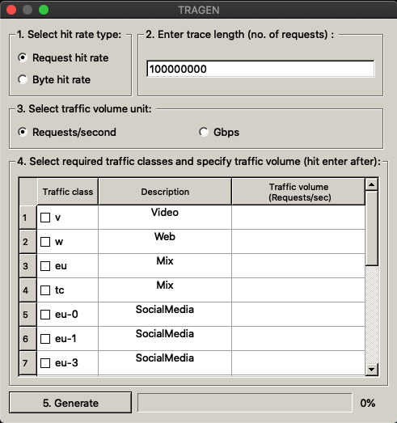

## TRAGEN

TRAGEN is a tool that produces synthetic traces that have similar caching properties as the original traces in the sense that the two traces will have the same hitrates in a cache simulation. TRAGEN is seeded with realistic footprint descriptor models [[1]] (#1) computed from original traces from Akamai's production CDNs that models the caching properties of the original traces. Using the footprint descriptors, TRAGEN produces a synthetic trace that fits the model.

## Installation

1. TRAGEN requires the installation of [python3](https://www.python.org/downloads/).

2. TRAGEN requires the following packages to be installed - numpy, scipy, pyQt5 and datetime.
       * ``` pip3 install numpy, scipy, pyQt5, datetime ```

## Synthetic trace generation.

In this mode, the user can select a traffic model from the [available traffic models](#available-traffic-models) to produce a synthetic trace that fits the model. The user can select a model that is described as Mix to generate a synthetic trace that is representative of the original trace obtained from a server that is serving a mix of traffic classes, eg., images from Amazon and software downloads from Microsoft. Or, the user can select multiple traffic models and provide the required traffic volumes for each selected option to create his/her own traffic mix. For e.g., 10Gbps of traffic from Amazon mixed with 5Gbps of traffic from Microsoft. TRAGEN then produces a synthetic trace that is representative of the traffic mix. We provide the option of using a GUI or a command line interface.

### GUI

Use the following command in the home directory of TRAGEN to operate in the GUI mode.
   * ``` python3 tragen_gui.py ```

You would see the following GUI. 




### Command line interface 

## Produce and submit traffic models


## Developer mode.

We welcome users to suggest modifications to improve the quality of the code or add new features to the existing codebase. Use the developer branch to make edits and submit a change.


## Available traffic models


## Cite


## References

<a id="1">[1]</a> 
Sundarrajan, Aditya, Mingdong Feng, Mangesh Kasbekar, and Ramesh K. Sitaraman. "Footprint descriptors: Theory and practice of cache provisioning in a global cdn." In Proceedings of the 13th International Conference on emerging Networking EXperiments and Technologies, pp. 55-67. 2017.

## Acknowledgements
This work was supported in part by NSF grants CNS-1763617 and CNS-1901137.
